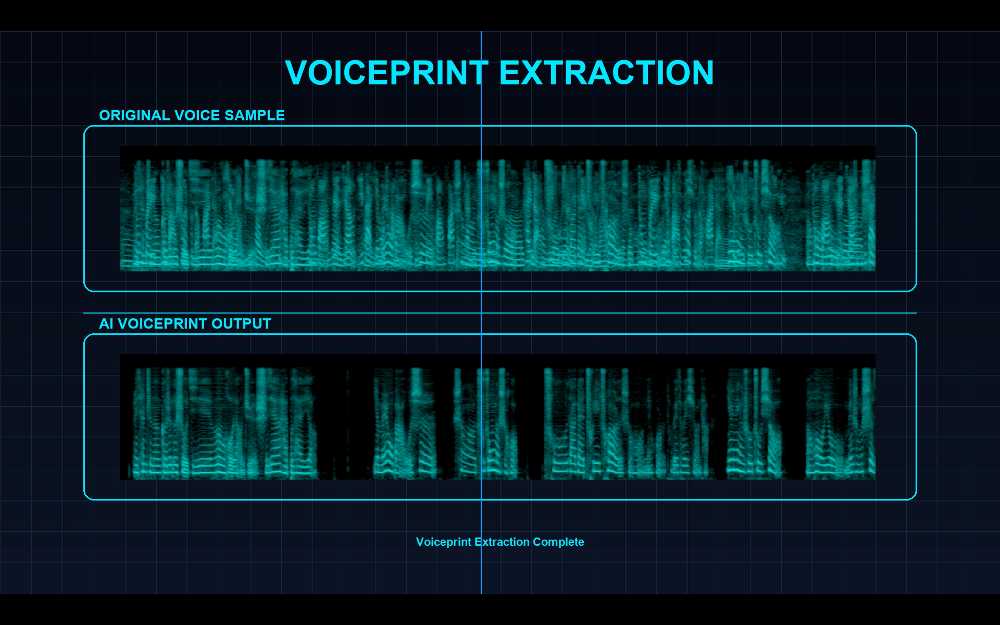

# Voiceprint Extraction Demo

Real-time Speaker Voiceprint Extraction powered by AI

---

## Overview

This project demonstrates a production-style Voiceprint Extraction pipeline that converts speech audio into compact and discriminative speaker embeddings (voiceprints).

It is designed for speaker recognition, verification, and audio intelligence applications.

---

## Live Demo

Click to watch the full demonstration:

---

## What is Voiceprint Extraction?

Voiceprint extraction transforms human speech into a unique biometric representation.

Each voice is encoded into a fixed-length embedding that captures:

- Speaker identity characteristics  
- Vocal timbre and tone  
- Speech patterns  
- Acoustic signatures  

---

## Key Features

- High-accuracy speaker embedding extraction  
- Real-time inference pipeline  
- Discriminative voice feature representation  
- Compatible with downstream AI systems  
- Modular architecture for integration  

---

## System Pipeline
