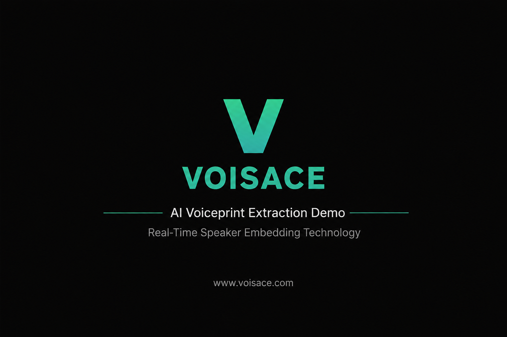

# Voisace AI Voiceprint Extraction Demo

---

## Video Demonstration

https://youtu.be/tPq5HyrJ8kA

---

## Description

This repository presents a demonstration of Voisace AI Voiceprint Extraction technology.

The system extracts compact and discriminative speaker embeddings from speech signals for speaker recognition, speaker verification, and voice intelligence applications. It is designed to operate reliably in real-world acoustic environments and can be deployed on edge AI hardware platforms.

The demonstration video showcases the voiceprint extraction process and the resulting speaker representation capabilities.

---

## Key Features

* Real-Time Voiceprint Extraction
* Speaker Embedding Generation
* Speaker Recognition
* Speaker Verification
* Noise-Robust Processing
* Edge AI Deployment Support
* Low-Latency Inference

---

## Applications

* Smart Conference Systems
* Voice Authentication
* Access Control Systems
* Voice Assistants
* Call Center Analytics
* Audio Intelligence Platforms
* Security and Monitoring Systems

---

## Technology

Voisace Acoustic AI combines advanced speech processing and deep learning technologies to generate robust speaker embeddings under challenging acoustic conditions.

The solution is optimized for embedded and edge computing platforms where computational efficiency and real-time performance are required.

---

## Website

https://www.voisace.com

---

## YouTube Channel

https://www.youtube.com/@VoisaceAcoustic

---

## Contact

For business inquiries and technical cooperation:

https://www.voisace.com

---

Copyright © Voisace. All Rights Reserved.
